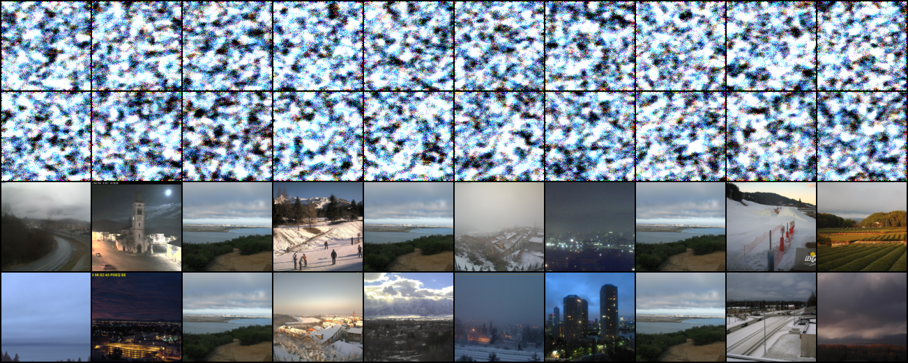
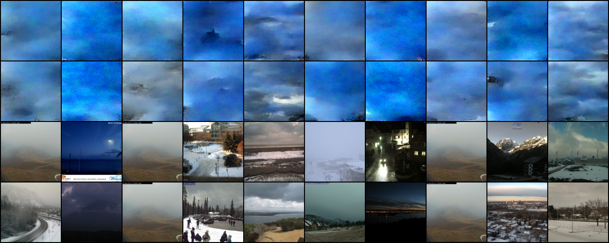
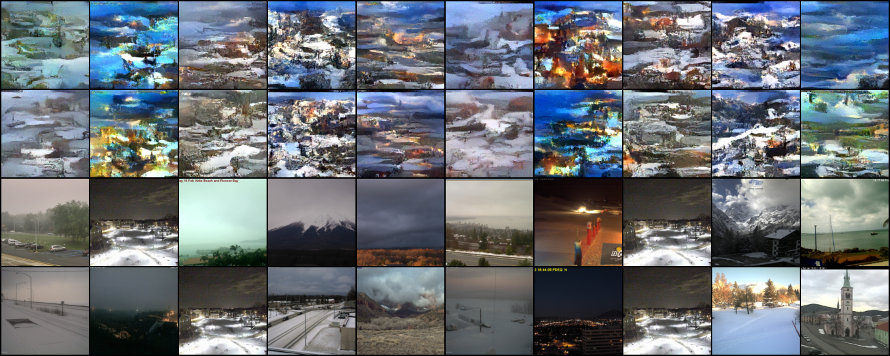
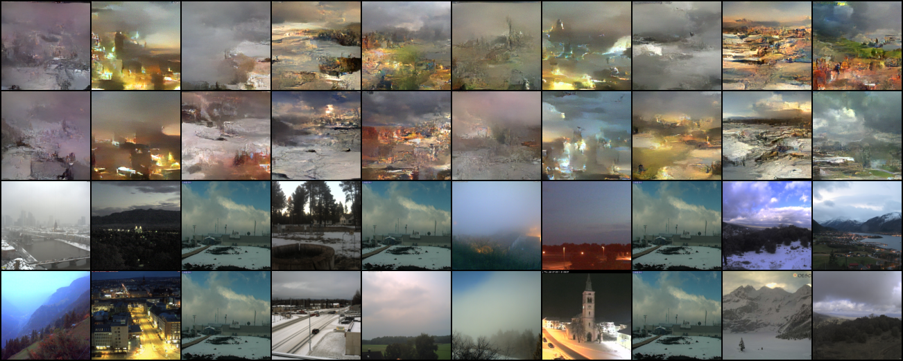
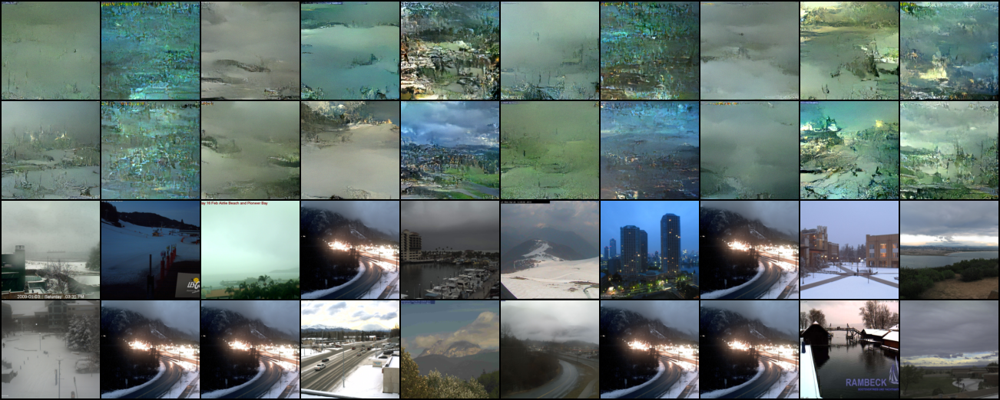
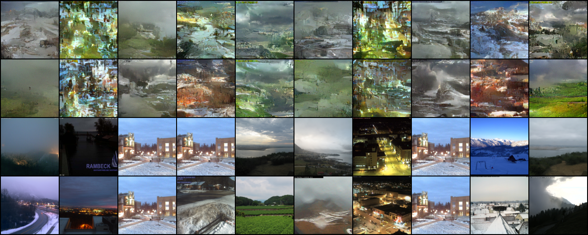
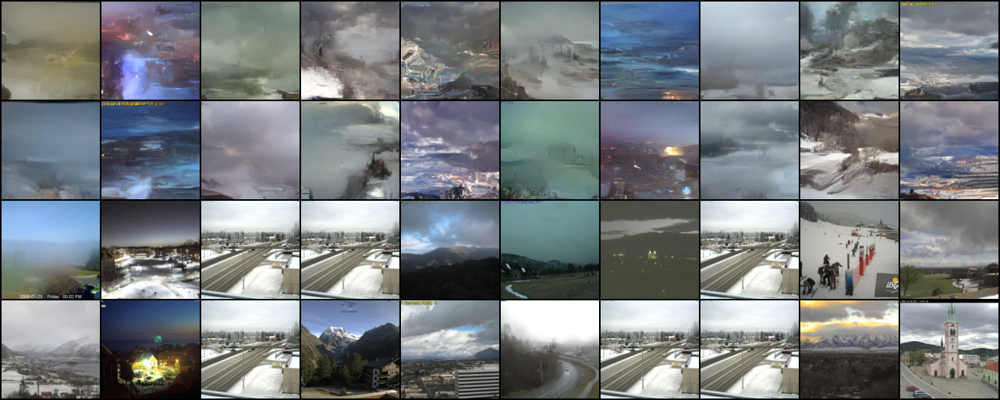
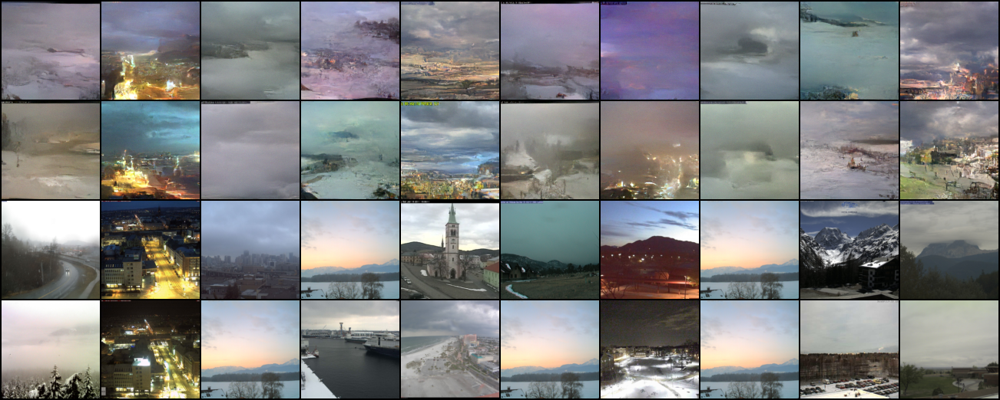

# Some current diffusion outputs during training 

The model seems to be learning to generate the images. Here are a few samples from each epoch. 
The first 2 rows are generated images, the last two are original images.

## Epoch 0

## Epoch 50

## Epoch 100

## Epoch 150

## Epoch 200

## Epoch 250

## Epoch 300

## Epoch 350

