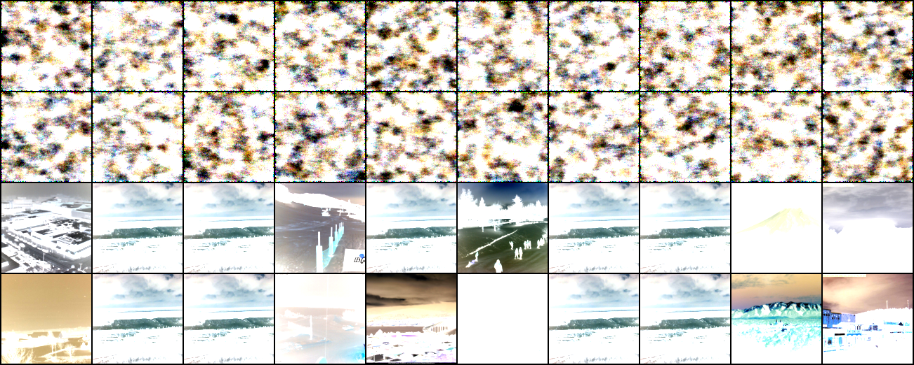
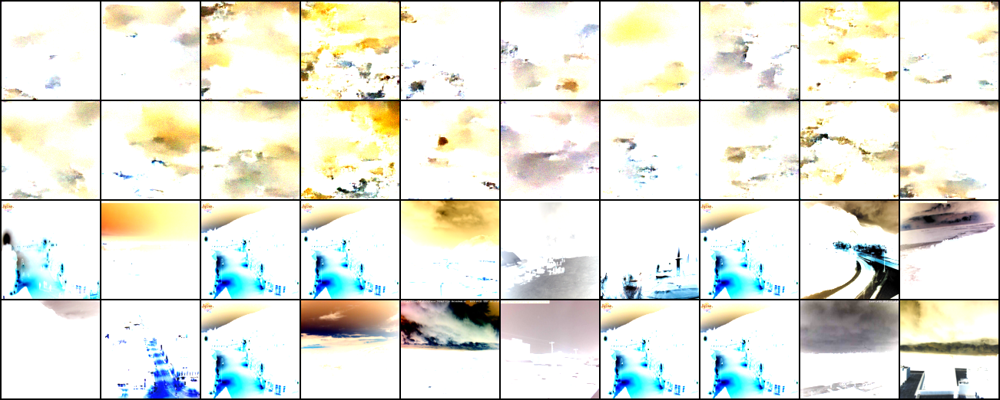
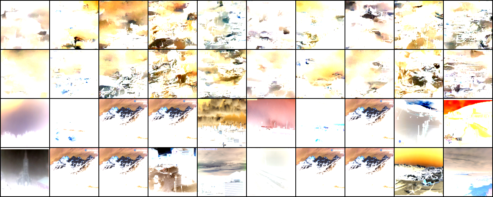
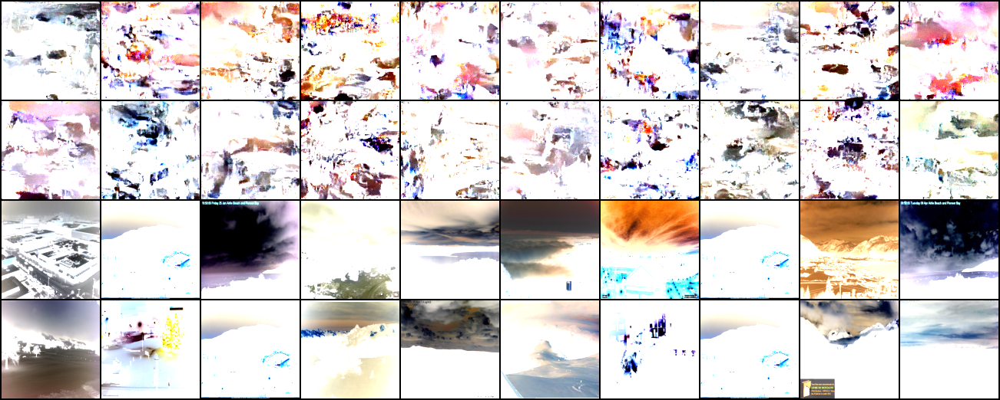

# Some current diffusion outputs during training 

The model seems to be learning very slowly. Here are a few samples from each epoch. 
Row1/Row3 and Row2/Row4 are the generated/original sample pairs.

## Epoch 0

## Epoch 20

## Epoch 40

## Epoch 60

## Epoch 80

